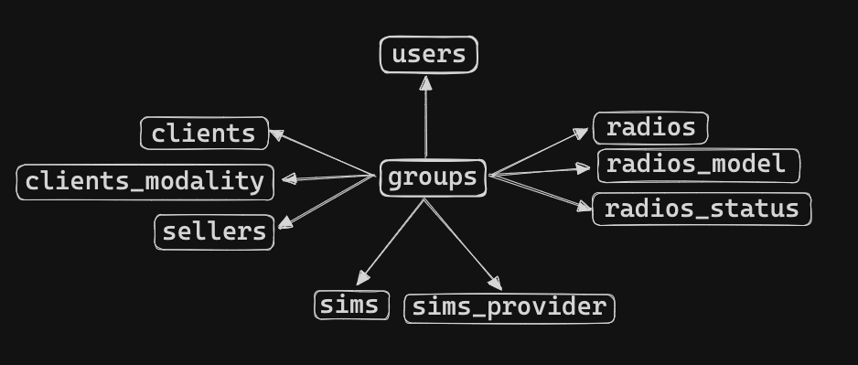
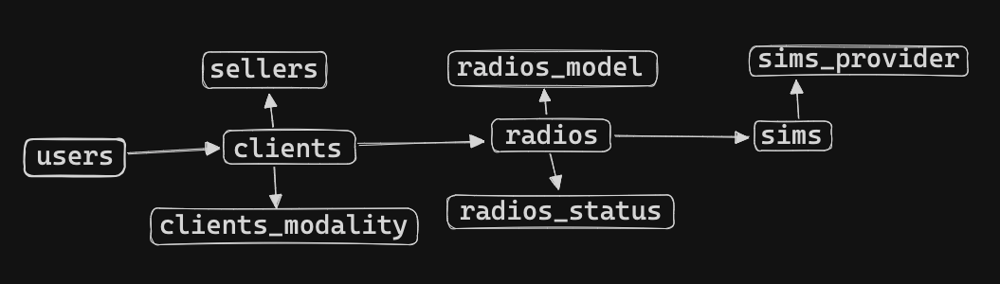
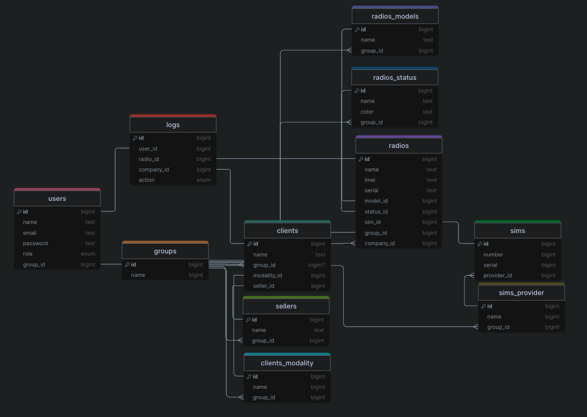

# Data Structure

## Indice
- [Description](#description)
- [Database Diagram](#database-diagram)
- [Tables](#tables)
    - [Groups](#groups)
    - [Users](#users)
    - [Clients](#clients)
    - [Radios](#radios)
    - [Sims](#sims)
    - [Clients Modalities](#clients-modalities)
    - [Sellers](#sellers)
    - [Radios Models](#radios-models)
    - [Radios Status](#radios-status)
    - [Sims Providers](#sims-providers)
    - [Logs](#logs)

## Description
The database is composed of 12 tables, the [groups](#groups) table is very important because it is used to separate all the data, one use case is to separate the data by country, so each country will have its own [users](#users), [clients](#clients), [radios](#radios), [sims](#sims), [clients-modalities](#clients-modalities), [sellers](#sellers), [radios-models](#radios-models), [radios-status](#radios-status) and [sims-providers](#sims-providers).

The [users](#users) table is used to store the users of the system, the users can be of two types, admin or user, the admin can do everything the user can do and can also manage the [users](#users) and [groups](#groups).

The [clients](#clients) table is used to store the clients of the system, the clients have a [modality](#clients-modalities) and a [seller](#sellers). The client can have multiple [radios](#radios).

The [radios](#radios) table is used to store the radios of the system, the radios have a [model](#radios-models), [status](#radios-status) and [SIM](#sims).

The [sims](#sims) table is used to store the SIMs of the system, the SIMs have a [provider](#sims-providers).

All the tables use the same structure, the `created_at` and `updated_at` fields are used to store the date and time the record was created and updated, the `deleted_at` field is used to store the date and time the record was deleted (soft delete).

The [logs](#logs) table is used to store the logs of the system, the logs have a [user](#users), [group](#groups), [radio](#radios), [client](#clients) and [SIM](#sims). The logs have an `action` field that is used to store the action of the log, the actions are: `create-client`, `create-radio`, `create-sim`, `add-radio-to-client`, `add-sim-to-radio`, `remove-radio-from-client`, `remove-sim-from-radio`, `swap-radio-from-client` and `swap-sim-from-radio`.

## Database Diagram

## Tables
### Groups
| Name | Type | Description |
| --- | --- | --- |
| id | int | The unique identifier of the group |
| name | string | The name of the group |
| created_at | datetime | The date and time the group was created |
| updated_at | datetime | The date and time the group was last updated |
| deleted_at | datetime | The date and time the group was deleted |

### Users
| Name | Type | Description |
| --- | --- | --- |
| id | int | The unique identifier of the user |
| code | string | The unique code of the user | 
| name | string | The name of the user |
| email | string | The email of the user |
| password | string | The password of the user |
| role | string | The role of the user (admin, user) |
| group_id | int | The unique identifier of the [group](#groups) |
| created_at | datetime | The date and time the user was created |
| updated_at | datetime | The date and time the user was last updated |
| deleted_at | datetime | The date and time the user was deleted |

### Clients
| Name | Type | Description |
| --- | --- | --- |
| id | int | The unique identifier of the client |
| code | string | The unique code of the client |
| name | string | The name of the client |
| color | string | The color of the client |
| group_id | int | The unique identifier of the [group](#groups) |
| modality_id | int | The unique identifier of the [modality](#clients-modalities)  |
| seller_id | int | The unique identifier of the [sellers](#sellers) |
| created_at | datetime | The date and time the client was created |
| updated_at | datetime | The date and time the client was last updated |
| deleted_at | datetime | The date and time the client was deleted |

### Radios
| Name | Type | Description |
| --- | --- | --- |
| id | int | The unique identifier of the radio |
| code | string | The unique code of the radio |
| name | string | The name of the radio |
| imei | string | The IMEI of the radio |
| serial | string | The serial of the radio |
| model_id | int | The unique identifier of the [model](#radios-models) |
| status_id | int | The unique identifier of the [status](#radios-status) |
| sim_id | int | The unique identifier of the [SIM](#sims) |
| client_id | int | The unique identifier of the [client](#clients) |
| group_id | int | The unique identifier of the [group](#groups) |
| created_at | datetime | The date and time the radio was created |
| updated_at | datetime | The date and time the radio was last updated |
| deleted_at | datetime | The date and time the radio was deleted |

### Sims
| Name | Type | Description |
| --- | --- | --- |
| id | int | The unique identifier of the SIM |
| code | string | The unique code of the SIM |
| number | string | The number of the SIM |
| serial | string | The serial of the SIM |
| provider_id | int | The unique identifier of the [provider](#sims-providers) |
| group_id | int | The unique identifier of the [group](#groups) |
| created_at | datetime | The date and time the SIM was created |
| updated_at | datetime | The date and time the SIM was last updated |
| deleted_at | datetime | The date and time the SIM was deleted |

### Clients Modalities
| Name | Type | Description |
| --- | --- | --- |
| id | int | The unique identifier of the client modality |
| code | string | The unique code of the client modality |
| name | string | The name of the client modality |
| color | string | The color of the client modality |
| group_id | int | The unique identifier of the [group](#groups) |
| created_at | datetime | The date and time the client modality was created |
| updated_at | datetime | The date and time the client modality was last updated |
| deleted_at | datetime | The date and time the client modality was deleted |

### Sellers
| Name | Type | Description |
| --- | --- | --- |
| id | int | The unique identifier of the seller |
| code | string | The unique code of the seller |
| name | string | The name of the seller |
| group_id | int | The unique identifier of the [group](#groups) |
| created_at | datetime | The date and time the seller was created |
| updated_at | datetime | The date and time the seller was last updated |
| deleted_at | datetime | The date and time the seller was deleted |

### Radios Models
| Name | Type | Description |
| --- | --- | --- |
| id | int | The unique identifier of the radio model |
| code | string | The unique code of the radio model |
| name | string | The name of the radio model |
| color | string | The color of the radio model |
| group_id | int | The unique identifier of the [group](#groups) |
| created_at | datetime | The date and time the radio model was created |
| updated_at | datetime | The date and time the radio model was last updated |
| deleted_at | datetime | The date and time the radio model was deleted |

### Radios Status
| Name | Type | Description |
| --- | --- | --- |
| id | int | The unique identifier of the radio status |
| code | string | The unique code of the radio status |
| name | string | The name of the radio status |
| color | string | The color of the radio status |
| group_id | int | The unique identifier of the [group](#groups) |
| created_at | datetime | The date and time the radio status was created |
| updated_at | datetime | The date and time the radio status was last updated |
| deleted_at | datetime | The date and time the radio status was deleted |

### Sims Providers
| Name | Type | Description |
| --- | --- | --- |
| id | int | The unique identifier of the SIM provider |
| code | string | The unique code of the SIM provider |
| name | string | The name of the SIM provider |
| color | string | The color of the SIM provider |
| group_id | int | The unique identifier of the [group](#groups) |
| created_at | datetime | The date and time the SIM provider was created |
| updated_at | datetime | The date and time the SIM provider was last updated |
| deleted_at | datetime | The date and time the SIM provider was deleted |

### Logs
| Name | Type | Description |
| --- | --- | --- |
| id | int | The unique identifier of the log |
| user_id | int | The unique identifier of the [user](#users) |
| group_id | int | The unique identifier of the [group](#groups) |
| radio_id | int | The unique identifier of the [radio](#radios) |
| client_id | int | The unique identifier of the [client](#clients) |
| sim_id | int | The unique identifier of the [SIM](#sims) |
| action | string | The action of the log ('create-client','create-radio','create-sim','add-radio-to-client','add-sim-to-radio','remove-radio-from-client','remove-sim-from-radio','swap-radio-from-client','swap-sim-from-radio') |
| created_at | datetime | The date and time the log was created |
| deleted_at | datetime | The date and time the log was deleted |